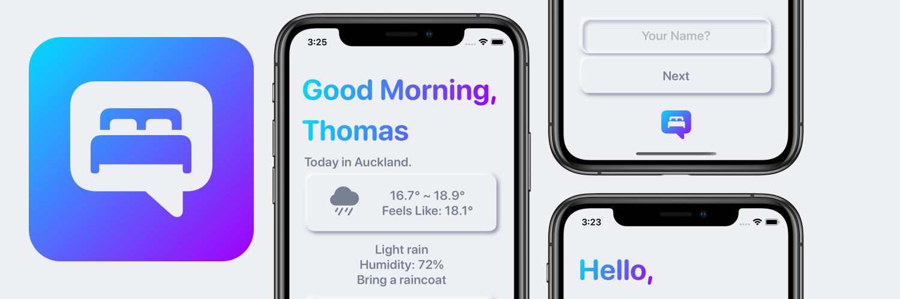

# GoodMorning

Draft

The goal was to consolodate my morning routine, rather than jump between apps that have infinate scrolling, i can simply open one or even just check the widget. The app is intentionally left simple to follow the 80 20 rule and reduce potential distractions for a calmer and more streamlined morning routine. I wanted to take advantage of the microservice aproach, there is no need to reinvent the wheel here and using microservices like apples own reminders allows for other apps to pull data created here for futher streamlining.

Nuemorphic design is making a return to the minimalist dominated world. I am quite nostaligic and very much a fan of more varitey in our UI. To me it makes the UX more joyfol and less strelie, while the modern simple proach to nue,orphic keeps distractions and clutter away.
