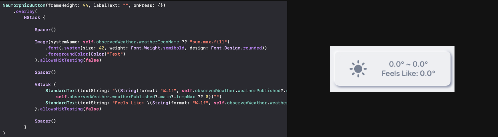
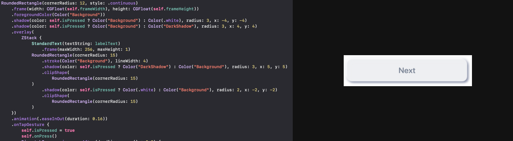
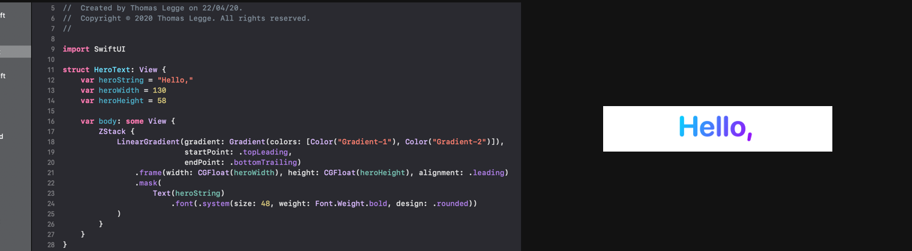
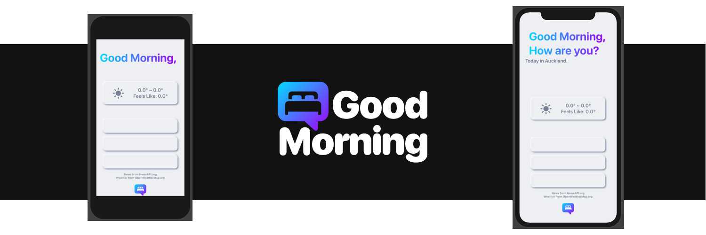

The goal was to consolodate my morning routine, rather than jump between apps that have infinate scrolling, I can simply open one. The app is intentionally left simple to follow the 80 20 rule and reduce potential distractions for a calmer and more streamlined morning routine. 

## Design with Code
Nuemorphic design is making a return to the minimalist dominated world. I am very much a fan of more varitey in our UI.

I went with programtic UI as I wanted to support the muiltiple sizes of screens and dynamic screens Apple is producing. It allows for pixel perfect elements.

## Web Service and Requests
The app is logically divided to allow for a web service, that populate view models containing data models. This is done with published variables in classes extending observable objects. Requests to REST APIs are made asyncronosly and load into the view to keep the main thread responsive.

