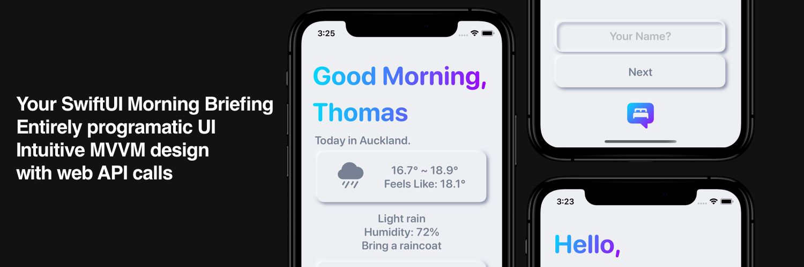

The goal was to consolodate my morning routine, rather than jump between apps that have infinate scrolling, I can simply open one. The app is intentionally left simple to follow the 80 20 rule and reduce potential distractions for a calmer and more streamlined morning routine. 

## Design
Nuemorphic design is making a return to the minimalist dominated world. I am very much a fan of more varitey in our UI.

## License
[MIT](https://choosealicense.com/licenses/mit/)

